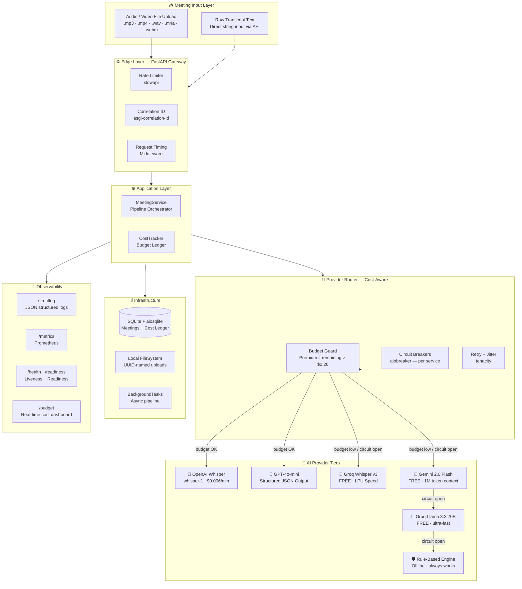
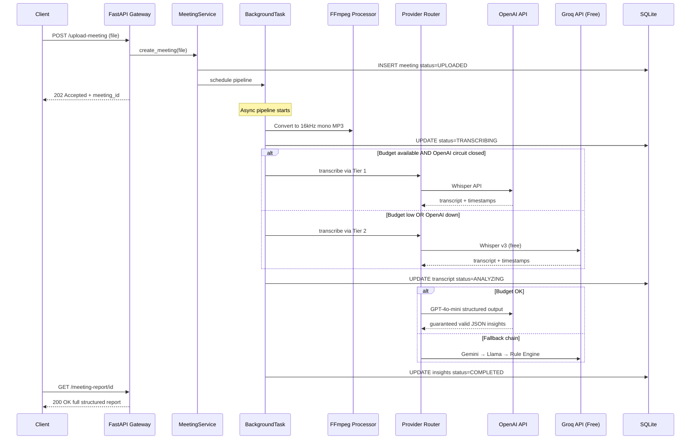
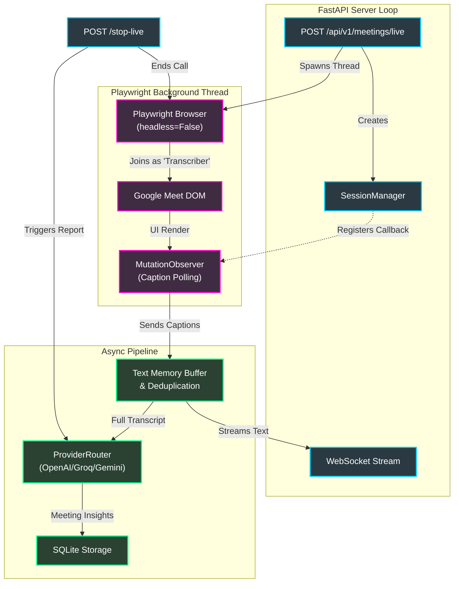

# Meeting Insight Agent 🎙️

> **AI-powered meeting analysis** — transcription, structured insights, action items, and productivity evaluation. OpenAI-first with intelligent 4-tier fallback chains.


---

## Live Demo

| Resource | URL |
|:---------|:----|
| **API Base** | `https://meeting-insight-agent.onrender.com/api/v1` |
| **Swagger UI** | `https://meeting-insight-agent.onrender.com/docs` |
| **ReDoc** | `https://meeting-insight-agent.onrender.com/redoc` |
| **Health** | `https://meeting-insight-agent.onrender.com/health` |

---

## System Architecture

### High-Level Architecture



### End-to-End Processing Pipeline



### Provider Priority Matrix

| Priority | STT | LLM | Cost | Quality |
|:---------|:----|:----|:-----|:--------|
| 🥇 Tier 1 | OpenAI Whisper | GPT-4o-mini | ~$0.20/meeting | ★★★★★ |
| 🥈 Tier 2 | Groq Whisper v3 | Gemini 2.0 Flash | $0 | ★★★★☆ |
| 🥉 Tier 3 | — | Groq Llama 3.3 70B | $0 | ★★★☆☆ |
| 🛡️ Tier 4 | — | Rule-Based Engine | $0 | ★★☆☆☆ |

---

## Model Selection

| Task | Primary | Fallback 1 | Fallback 2 | Fallback 3 |
|:-----|:--------|:----------|:----------|:----------|
| **Speech-to-Text** | OpenAI `whisper-1` | Groq `whisper-large-v3` | — | — |
| **Meeting Analysis** | OpenAI `gpt-4o-mini` (structured output) | Google `gemini-2.0-flash` | Groq `llama-3.3-70b-versatile` | Regex rule engine |

**Why GPT-4o-mini?** — Native `response_format: json_schema` support guarantees the output matches the Pydantic schema exactly. No parsing failures, no missing fields.

**Why Groq?** — Fastest inference available (LPU hardware), completely free tier, near-OpenAI quality on Whisper.

---

## API Endpoints

| Method | Endpoint | Description |
|:-------|:---------|:-----------|
| `POST` | `/api/v1/meetings/upload` | Upload audio/video file |
| `POST` | `/api/v1/meetings/analyze` | Analyze meeting or raw transcript |
| `GET` | `/api/v1/meetings/{id}/status` | Poll processing status |
| `GET` | `/api/v1/meetings/{id}/report` | Get full structured report |
| `GET` | `/api/v1/budget` | Real-time cost tracking dashboard |
| `GET` | `/health` | Liveness probe |
| `GET` | `/readiness` | Readiness probe (checks all deps) |
| `GET` | `/metrics` | Prometheus metrics |

---

## Quick Start (Local)

### Prerequisites

| Requirement | Version | Install |
|:------------|:--------|:--------|
| Python | 3.12+ | [python.org](https://python.org) |
| FFmpeg | Any | `choco install ffmpeg` · `brew install ffmpeg` · `apt install ffmpeg` |
| Git | Any | [git-scm.com](https://git-scm.com) |
| API Keys | — | OpenAI + Groq (free) + Gemini (free) |

Get free keys:
- **Groq** (required for free tier STT + LLM): [console.groq.com](https://console.groq.com) → create key
- **Gemini** (optional, extra LLM fallback): [aistudio.google.com](https://aistudio.google.com) → Get API key
- **OpenAI** (optional, best quality): [platform.openai.com/api-keys](https://platform.openai.com/api-keys)

---

### Step-by-Step Setup

**1. Clone the repository**

```bash
git clone https://github.com/Mighty2Skiddie/Meeting-insight-agent
cd Meeting-insight-agent
```

**2. Create a virtual environment**

```bash
# Windows
python -m venv myvenv
myvenv\Scripts\activate

# macOS / Linux
python -m venv myvenv
source myvenv/bin/activate
```

**3. Install dependencies**

```bash
pip install -e ".[dev]"
```

**4. Configure environment variables**

```bash
# Copy the example env file
cp .env.example .env
```

Open `.env` and set your values:

```env
# ── Required ──────────────────────────────────────────────
GROQ_API_KEY=gsk_xxxxxxxxxxxxxxxxxxxxxxxxxxxxxxxx
GEMINI_API_KEY=AIxxxxxxxxxxxxxxxxxxxxxxxxxxxxxxx

# ── Recommended (enables best-quality Tier 1) ─────────────
OPENAI_API_KEY=sk-proj-xxxxxxxxxxxxxxxxxxxxxxxx

# ── Storage (leave as-is for local development) ───────────
DATABASE_URL=sqlite+aiosqlite:///./data/meetings.db
UPLOAD_DIR=./data/uploads

# ── Tuning ────────────────────────────────────────────────
ENVIRONMENT=development
LOG_LEVEL=INFO
BUDGET_LIMIT_USD=2.00
BUDGET_RESERVE_USD=0.20
MAX_UPLOAD_SIZE_MB=200
```

> **Note:** Keys prefixed `gsk_` are Groq keys. Keys prefixed `sk-` are OpenAI keys. Gemini keys start with `AI`. The system validates these prefixes at startup — a wrong format is treated as missing.

**5. Verify FFmpeg is installed**

```bash
ffmpeg -version
# Should print: ffmpeg version X.X ...
```

If it fails on Windows: `choco install ffmpeg` then restart your terminal.

**6. Run the development server**

```bash
uvicorn src.main:app --reload --port 8000
```

You should see:
```
INFO:     Uvicorn running on http://127.0.0.1:8000 (Press CTRL+C to quit)
INFO:     Started reloader process
```

**7. Verify it's working**

```bash
curl http://localhost:8000/health
# {"status":"ok","uptime_seconds":2.1,"version":"1.0.0"}

curl http://localhost:8000/readiness
# {"status":"ready","checks":{"database":{"status":"ok"},"api_keys":{"openai":"configured","groq":"configured","gemini":"configured"}}}
```

---

### Docker (Alternative)

```bash
cp .env.example .env   # Fill in your keys
docker build -t meeting-insight-agent .
docker run -p 8000:8000 --env-file .env meeting-insight-agent
```

---

## Using the API

### Interactive Swagger UI (Recommended for First Use)

Open **http://localhost:8000/docs** in your browser.

You get a full interactive UI where you can:
- Upload audio files directly with a file picker
- See exact request/response schemas
- Try every endpoint with real data
- Authorize with API keys if needed

> **Tip:** Click **"Try it out"** on any endpoint, fill in the fields, and click **"Execute"**. The UI shows you the exact `curl` command it used.

---

### Endpoint Reference — Complete Usage Guide

#### 1. Upload a Meeting File

Accepts any audio or video format. Returns a `meeting_id` immediately — processing happens in the background.

```bash
curl -X POST http://localhost:8000/api/v1/meetings/upload \
  -F "file=@/path/to/your/meeting.mp3" \
  -F "title=Q2 Sprint Planning"
```

**Supported formats:** `.mp3` `.mp4` `.wav` `.m4a` `.webm` `.ogg` `.flac` `.mkv` `.mov` `.avi`

**Response:**
```json
{
  "meeting_id": "550e8400-e29b-41d4-a716-446655440000",
  "status": "UPLOADED",
  "estimated_duration_seconds": 60,
  "provider_tier": "premium",
  "tracking_url": "/api/v1/meetings/550e8400-e29b-41d4-a716-446655440000/status"
}
```

Save the `meeting_id` — you'll need it for all subsequent calls.

**Python client:**
```python
import httpx

with open("meeting.mp3", "rb") as f:
    response = httpx.post(
        "http://localhost:8000/api/v1/meetings/upload",
        files={"file": ("meeting.mp3", f, "audio/mpeg")},
        data={"title": "Q2 Sprint Planning"},
    )

data = response.json()
meeting_id = data["meeting_id"]
print(f"Uploaded. Tracking: {data['tracking_url']}")
```

---

#### 2. Poll Processing Status

Processing runs in the background. Poll this endpoint every 2-3 seconds until status is `COMPLETED` or `FAILED`.

```bash
curl http://localhost:8000/api/v1/meetings/550e8400-e29b-41d4-a716-446655440000/status
```

**Response (in progress):**
```json
{
  "meeting_id": "550e8400-e29b-41d4-a716-446655440000",
  "status": "TRANSCRIBING",
  "progress_percent": 25,
  "current_step": "Transcribing audio",
  "provider_tier": "free",
  "error": null
}
```

**Status progression:**
```
UPLOADED (5%) → TRANSCRIBING (10-49%) → ANALYZING (50-99%) → COMPLETED (100%)
                                                            ↘ FAILED (any step)
```

**Python polling loop:**
```python
import time
import httpx

def wait_for_completion(meeting_id: str, base_url: str = "http://localhost:8000") -> dict:
    url = f"{base_url}/api/v1/meetings/{meeting_id}/status"
    for attempt in range(60):  # max 2 minutes at 2s intervals
        response = httpx.get(url)
        data = response.json()
        status = data["status"]
        print(f"[{attempt*2}s] {status} — {data['progress_percent']}% — {data['current_step']}")
        if status == "COMPLETED":
            return data
        if status == "FAILED":
            raise RuntimeError(f"Processing failed: {data['error']}")
        time.sleep(2)
    raise TimeoutError("Processing did not complete within 2 minutes")

result = wait_for_completion(meeting_id)
```

---

#### 3. Get the Full Report

Only call this when status is `COMPLETED`. Returns the full transcript and all AI-generated insights.

```bash
curl http://localhost:8000/api/v1/meetings/550e8400-e29b-41d4-a716-446655440000/report
```

**Full response schema:**
```json
{
  "meeting_id": "550e8400-e29b-41d4-a716-446655440000",
  "title": "Q2 Sprint Planning",
  "duration_seconds": 2340.5,
  "duration_formatted": "39m 0s",
  "transcript": {
    "full_text": "Alice: Let's start with the mobile launch timeline...",
    "segments": [
      {
        "speaker": "Speaker 1",
        "start": 0.0,
        "end": 12.4,
        "text": "Let's start with the mobile launch timeline."
      }
    ],
    "word_count": 542,
    "language": "English"
  },
  "insights": {
    "summary": "The team aligned on Q2 priorities, confirming the mobile app launch as the top initiative for June with Bob leading delivery...",
    "key_decisions": [
      "Mobile app launch scheduled for June 15th",
      "Budget approved for third-party testing partner"
    ],
    "action_items": [
      {
        "task": "Finalize mobile app delivery plan",
        "owner": "Speaker 1",
        "priority": "high",
        "deadline_mentioned": "June 15th"
      },
      {
        "task": "Shortlist testing vendors and share with team",
        "owner": "Speaker 2",
        "priority": "medium",
        "deadline_mentioned": null
      }
    ],
    "discussion_topics": [
      {
        "topic": "Mobile app launch timeline",
        "time_spent_percent": 40,
        "resolution": "resolved"
      },
      {
        "topic": "Q2 budget allocation",
        "time_spent_percent": 35,
        "resolution": "resolved"
      }
    ],
    "productivity": {
      "score": "Productive",
      "reasoning": "Clear decisions were made with assigned owners. The meeting stayed on topic with concrete outcomes for both agenda items.",
      "confidence": 0.87,
      "improvement_suggestions": [
        "Share agenda 24 hours before next meeting to improve prep time"
      ]
    },
    "sentiment": "Positive",
    "follow_up_meeting_needed": true
  },
  "metadata": {
    "status": "COMPLETED",
    "provider_stt": "openai_whisper",
    "provider_llm": "gpt_4o_mini",
    "tier_used": "premium",
    "degraded": false,
    "cost_usd": 0.21,
    "processing_time_seconds": 18.4,
    "created_at": "2026-04-10T09:20:47",
    "completed_at": "2026-04-10T09:21:05"
  }
}
```

**Python — one-liner full workflow:**
```python
import time, httpx

BASE = "http://localhost:8000"

# Upload
with open("meeting.mp3", "rb") as f:
    resp = httpx.post(f"{BASE}/api/v1/meetings/upload", files={"file": f})
meeting_id = resp.json()["meeting_id"]

# Poll
while True:
    status = httpx.get(f"{BASE}/api/v1/meetings/{meeting_id}/status").json()
    if status["status"] in ("COMPLETED", "FAILED"):
        break
    time.sleep(2)

# Report
report = httpx.get(f"{BASE}/api/v1/meetings/{meeting_id}/report").json()
print(report["insights"]["summary"])
print("Action items:")
for item in report["insights"]["action_items"]:
    print(f"  [{item['priority'].upper()}] {item['task']} → {item['owner']}")
```

---

#### 4. Analyze a Raw Transcript (No File Upload)

Have text already? Skip the audio step entirely.

```bash
curl -X POST http://localhost:8000/api/v1/meetings/analyze \
  -H "Content-Type: application/json" \
  -d '{
    "transcript": "Alice: We need to decide on the launch date. Bob: I think June 15th works. Alice: Agreed. Bob: I will prepare the rollout plan by Friday."
  }'
```

**Response:**
```json
{
  "meeting_id": "7f3a9200-...",
  "status": "COMPLETED",
  "insights": {
    "summary": "A brief alignment meeting where Alice and Bob agreed on a June 15th launch date...",
    "key_decisions": ["Launch date set to June 15th"],
    "action_items": [
      {
        "task": "Prepare rollout plan",
        "owner": "Bob",
        "priority": "high",
        "deadline_mentioned": "Friday"
      }
    ],
    "productivity": {
      "score": "Productive",
      "reasoning": "Clear decision made immediately with a concrete action item assigned.",
      "confidence": 0.95
    },
    "sentiment": "Positive",
    "follow_up_meeting_needed": false
  },
  "provider": "gpt_4o_mini",
  "cost_usd": 0.001
}
```

---

#### 5. Check Budget Usage

```bash
curl http://localhost:8000/api/v1/budget
```

**Response:**
```json
{
  "budget_limit_usd": 2.00,
  "total_spent_usd": 0.63,
  "remaining_usd": 1.37,
  "reserve_usd": 0.20,
  "premium_available": true,
  "active_tier": "premium",
  "breakdown_by_provider": {
    "openai_whisper": 0.42,
    "gpt_4o_mini": 0.21
  },
  "meetings_processed": 3
}
```

When `remaining_usd` drops below `reserve_usd`, the system automatically switches from OpenAI to free-tier providers.

---

#### 6. Readiness Check — Verify Your Setup

```bash
curl http://localhost:8000/readiness | python -m json.tool
```

**What to look for:**
```json
{
  "status": "ready",
  "checks": {
    "database": { "status": "ok", "latency_ms": 0.4 },
    "openai_api": { "status": "ok", "circuit": "closed" },
    "groq_api":   { "status": "ok", "circuit": "closed" },
    "gemini_api": { "status": "ok", "circuit": "closed" },
    "budget": {
      "status": "ok",
      "remaining_usd": 1.37,
      "active_tier": "premium"
    },
    "api_keys": {
      "openai": "configured",
      "groq": "configured",
      "gemini": "configured"
    }
  }
}
```

| Value to check | Good | Bad |
|:--------------|:-----|:----|
| `status` | `"ready"` | `"not_ready"` or `"degraded"` |
| `database.status` | `"ok"` | `"error"` — check `DATABASE_URL` |
| `api_keys.openai` | `"configured"` | `"missing"` — check your `.env` key format (`sk-...`) |
| `api_keys.groq` | `"configured"` | `"missing"` — check your `.env` key format (`gsk_...`) |
| `budget.status` | `"ok"` | `"low"` — remaining <= reserve; free tier only |
| `*.circuit` | `"closed"` | `"open"` — provider was failing; waits 2 min to reset |

---

#### 7. Prometheus Metrics

```bash
curl http://localhost:8000/metrics
```

Connect Grafana or any Prometheus-compatible tool to this endpoint. Key metrics:

| Metric | Type | What it tells you |
|:-------|:-----|:-----------------|
| `meetings_processed_total` | Counter | Total completed/failed meetings |
| `meeting_processing_duration_seconds` | Histogram | End-to-end pipeline time |
| `transcription_duration_seconds` | Histogram | STT time per provider |
| `analysis_duration_seconds` | Histogram | LLM time per provider |
| `active_background_jobs` | Gauge | Pipelines running right now |
| `cost_per_meeting_usd` | Histogram | Dollar cost distribution |
| `fallback_activations_total` | Counter | How often cheaper tiers were used |

---

### Common Issues

| Issue | Likely Cause | Fix |
|:------|:------------|:----|
| `api_keys.groq: "missing"` | Key format wrong | Groq keys start with `gsk_` — regenerate if needed |
| `api_keys.openai: "missing"` | Key format wrong | OpenAI keys start with `sk-` or `sk-proj-` |
| `status: "FAILED"` on upload | FFmpeg not found | Run `ffmpeg -version`. Install if missing. |
| `status: "FAILED"` on analyze | LLM API error | Check `/readiness` → look for open circuit breakers |
| Upload returns 413 | File too large | Default max is 200MB. Change `MAX_UPLOAD_SIZE_MB` in `.env` |
| Upload returns 415 | Wrong file type | Only audio/video formats are accepted |
| `database.status: "error"` | DB path not writable | Create the `./data/` directory manually or change `DATABASE_URL` |
| Insights always `null` | All LLM providers failed | Check `/readiness` — all providers may be circuit-broken. Wait 2 min. |

---

## Running Tests

```bash
# Unit tests only (no API calls, uses in-memory SQLite)
pytest tests/unit/ -v

# With coverage report
pytest tests/unit/ -v --cov=src --cov-report=term-missing

# Type checking
mypy src/ --ignore-missing-imports

# Linting
ruff check src/ tests/

# End-to-end integration test (requires running server + valid API keys)
python samples/test_api.py
# Uploads sample file → polls until complete → validates report fields
```

---


| Decision | Rationale |
|:---------|:----------|
| **SQLite over PostgreSQL** | Zero-config for Assignment. Abstracted via Repository pattern — swap to Postgres with one config line. |
| **BackgroundTasks over ARQ/Celery** | No Redis needed → fits Render free 512MB RAM. Trade-off: jobs lost on crash (acceptable for prototype). |
| **Cloud-only STT fallback** | Local Faster-Whisper needs ~1GB RAM; Render free tier has 512MB. Groq free STT is equivalent quality. |
| **Rule-based Tier 4** | Always-on insurance policy — the system produces *something* even with zero API connectivity. |
| **GPT-4o-mini over GPT-4o** | 95% quality at 10% of the price (within $2 budget). Structured outputs eliminate parsing risk. |
| **OpenTelemetry over Datadog SDK** | Vendor neutral — can switch to any observability backend without code changes. |

---

## Phase 2: Live Meeting Integration (Google Meet Bot)

This codebase effectively completes **Phase 2** of the assignment objectives, supporting true **Live Google Meet Integration** via an automated web scraping strategy.

> **⚠️ LOCAL EXECUTION ONLY:** The Playwright bot relies on Chrome's `headless=False` configuration targeting Microsoft Edge. Google Meet's anti-bot detection actively prevents standard headless Chromium deployments (like `headless=True`), and skips rendering the live caption DOM elements completely when the page is strictly hidden. Because it requires a physical display/window manager to trick Google Meet into rendering the UI, this live feature is fully functional **locally**, but unsupported out-of-the-box on basic visual-less cloud instances (like Render's free tier) without advanced display server configurations (e.g., `Xvfb`).

### Live Bot Architecture



### How To Use It

You can run the live integration with just a standard Google Meet link. 

1. **Start a Live Google Meet:** Host a Google Meet and copy the join URL (`https://meet.google.com/xxx-xxxx-xxx`).
2. **Launch the Local Server:** Ensure your API backend is active.
   ```bash
   uvicorn src.main:app --reload --port 8000
   ```
3. **Run the Live Test Pipeline:** Open a separate terminal and start the driver script. Include your URL and an optional duration cut-off (e.g., `120` seconds).
   ```bash
   python samples/test_live_meeting.py --url https://meet.google.com/xxx-xxxx-xxx --duration 120
   ```
4. **Approve the Bot (Crucial Step):** The Microsoft Edge browser will silently launch and prompt for permission. **You must hit "Admit" inside your Google Meet session for the bot to join**.
5. **Silent Mode & Captions:** Once admitted, the bot instantly mutes its own mic/camera on the pre-join screen to avoid echo, then clicks "Turn on captions."
6. **Live Streaming:** As people in the meeting talk, the bot polls the DOM, pushing transcript buffers across the webhook directly to your terminal.
7. **Final AI Insights:** When stopped or timed-out, the bot unloads. The buffered transcript is instantly routed through `ProviderRouter` (checking budget and availability for OpenAI -> Gemini -> Groq -> Rule Based) resulting in the finalized Meeting Insights data.

---

## Running Tests

```bash
# Unit tests (no API calls)
pytest tests/unit/ -v --cov=src

# Type checking
mypy src/ --ignore-missing-imports

# Linting
ruff check src/ tests/
```

---

